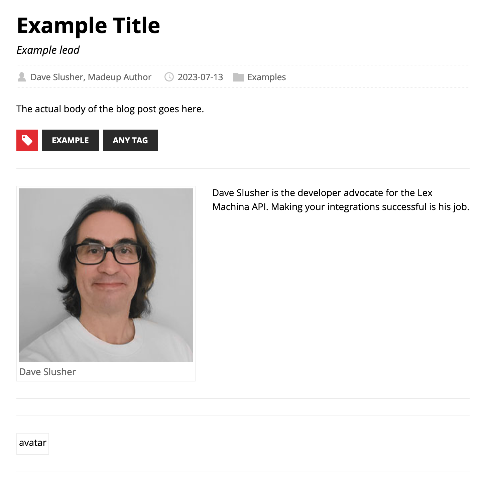

# Lex Machina Developer Blog

The Lex Machina developer blog lives at https://blog.developer.lexmachina.com/ . It is a [Hugo](https://gohugo.io/) based static site that is built by Github Actions and pushed to Github Pages with a custom domain. It can be posted to via commits to this repository, directions below.

## Posting Guide

The directory that contains the posts  is /content/post/ inside this repository. To create a post, first create a sub-directory in there, named what you want the slug in the URL to be. By convention, use only lowercase and dashes to separate words.


Inside this directory, create a file named "index.md". If you have images to add to the post, you can either put them in a images directory or loose in the same directory as the Markdown file. 

Here is what the URL looks like for the above subdirectory.


Inside the index.md, create the template of the post. You can cut-and-paste this example and change what you need.

```
---
title: Example Title
date: 2023-07-13T06:00:00-04:00
draft: false
description: Example description
lead: Example lead
authors: [Dave Slusher, Madeup Author]
categories:
    - Examples
tags: 
    - Example
    - Any tag
---
The actual body of the blog post goes here.
```

Most of the frontmatter is self explanatory. If you are working a post you don’t yet want published, set ```draft: true``` 

The date is important in that if it is in the future when the site is built, it won’t show. It doesn’t matter too much what the hour is as long as it is in the past as only the date shows on anything. I ususually leave all the times alone at 10 AM -4UTC and just change the date.

Because of the multi-author setup, the authors field in the YAML of the frontmatter must be an array. There will mostly only be a single author on a post but they still need the square brackets or it will break the blog building.

The example post above will render like this on the main page:


The example post will look like this when clicked:



This example has an author without a matching entry in /content/authors which is why the blank photo. If matching data is found, multiple authors will be filled out with bio and headshots on the posts.

As long as ```draft: true``` is set in the Markdown frontmatter of a post, there is no risk in it being made public. Feel free to commit drafts to the content directory to make posts, and then let the API team know when you want it published.

## Running the Developer Blog Build Locally

- In order to build and serve the developer blog locally, first you must [install Hugo](https://gohugo.io/installation/). There are prebuilt binaries for MacOS, Linux and Windows as well as Homebrew packages and others.

- Clone this repository and from a command line cd to the root directory.

- Run the command

    ```  hugo serve -D ```

    The "-D" flag turns on building of posts and pages with ```draft: true``` so it is useful to do a preview prior to publication. The "-F" does the same thing but for future posts.

- When the process runs, the address http://localhost:1313 will now be the base URL of the developer blog. Other than showing draft posts it should look otherwise the same as production.