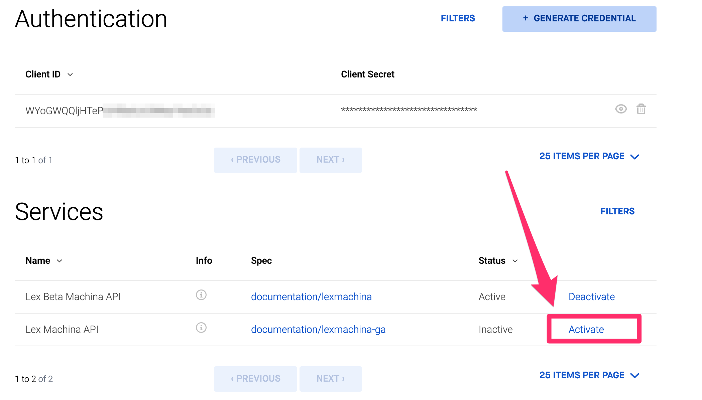

After long alpha and beta periods, much development and customer input the day has arrived. The Lex Machina API is in General Availability release!

This release now includes state court data. In order to create endpoints and schemas that have some consistency across district and state data, refactoring was necessary. For those who are directly implementing access to our API, this will require some changes to code. There is a guide to the changes in the developer portal at https://developer.lexmachina.com/default/docs/migrating_to_ga . At a very high level, endpoints for lists of resources now require either "FederalDistrict" or "State" as parameters. There are two query endpoints, one for district and one for state and an additional endpoint /state-cases/ to look up case information. While the state query endpoint takes many of the same parameters as does district, there is a page documenting the parts that are different at https://developer.lexmachina.com/default/docs/state_query_usage

In order to access the GA version of the API, you of course need an application in the developer portal. If you have existing ones that you have been using with beta you can continue to use the same credentials. However, you will need to activate this API as accessible for this app and credentials. Underneath the Services section of your application information, there will now be a line for the "Lex Machina API". If you activate that service, your credentials will now grant access to GA.

If you have not logged in to the Lex Machina developer portal since April 12th, our infrastructure has changed. You will need to register to create a new account and create new applications and credentials to use either beta or the GA versions of the API. While this disruption is unfortunate, we have found in the last month that the new system is superior on basically every aspect. If you need assistance with accounts, please feel free to email dslusher@lexmachina.com.

For those users who are using the Node library to write JavaScript programs to access Lex Machina, be aware that there is a new version of the package published to NPM as 2.0.0. This version is only compatible with the GA version of the API. If you are continuing with the beta version for the time being, be aware that you must use the 1.0.* packages to access the API. In addition, a Python client will published to PyPI soon.

Going forward this email list will be used to periodically inform our customers and developers of news about the API, the client packages and other technical topics you need to know. If projects or roles have shifted such that this is no longer your responsibility, you have the ability to unsubscribe at any time.

A big thank you to all the customers who helped us reach this point. Your feedback helped us craft this new release of the API and your usage has helped us improve performance and reliability. We are excited for you to realize the potential of the Lex Machina API and to create value for your companies via automation and data driven decisions. Here's to the future.

The Lex Machina Team