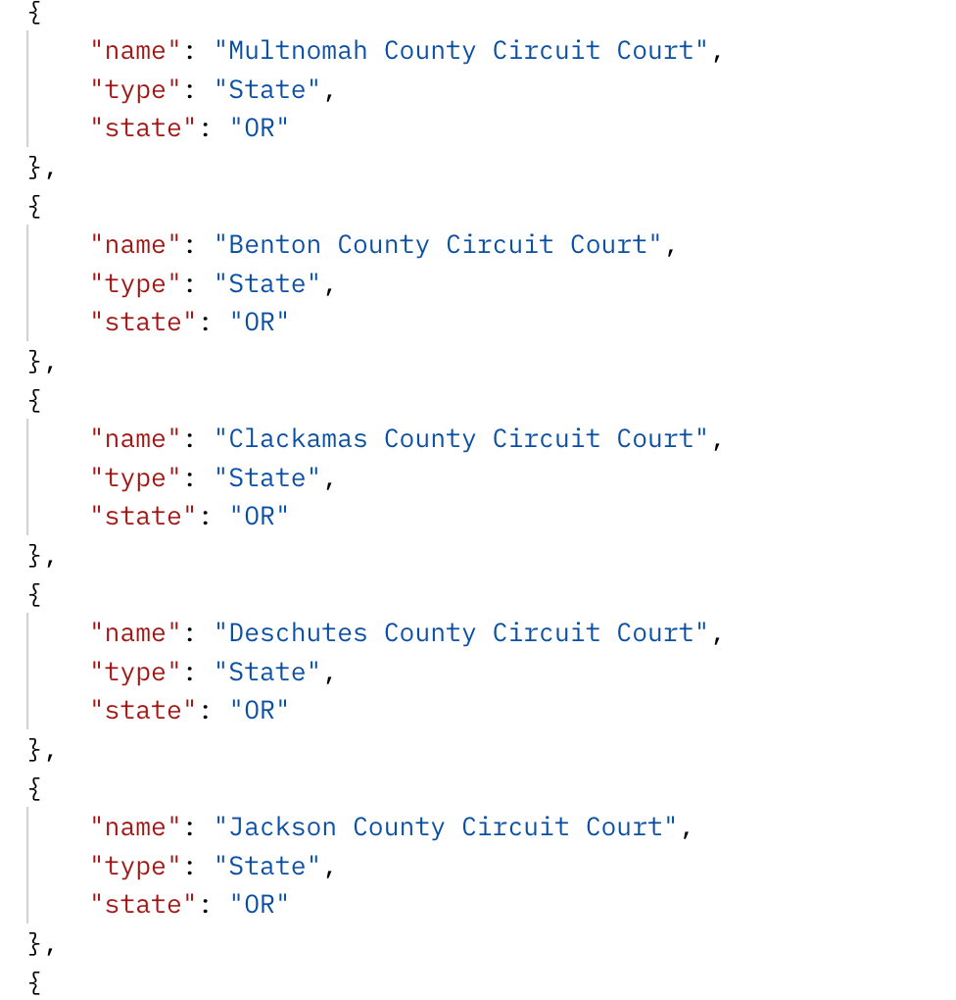

The most recent state courts to be added to the Lex Machina data include nine county circuits from Oregon. These nine counties are from the top 11 most populous counties in the state so while 25% of the counties in Oregon, it covers 73% of the population. The goal is to expand to the rest of the counties by the end of the year. (This is an aspiration, not a promise or binding contract.)

The available courts now appear in the /list-courts/State endpoint. All the values from that endpoint are now available for state court queries.

Interestingly, if you have a script that iterated over the list of state courts and performed a query on each tuple then at some point this week you would have automatically started querying the newly available courts without even trying to.

Lex Machina continues to expand the courts covered. As those courts go live that data is also available to the API users. As noted, sometimes that new data can be exercised automatically by your processes. More value for the same work - what could be better?