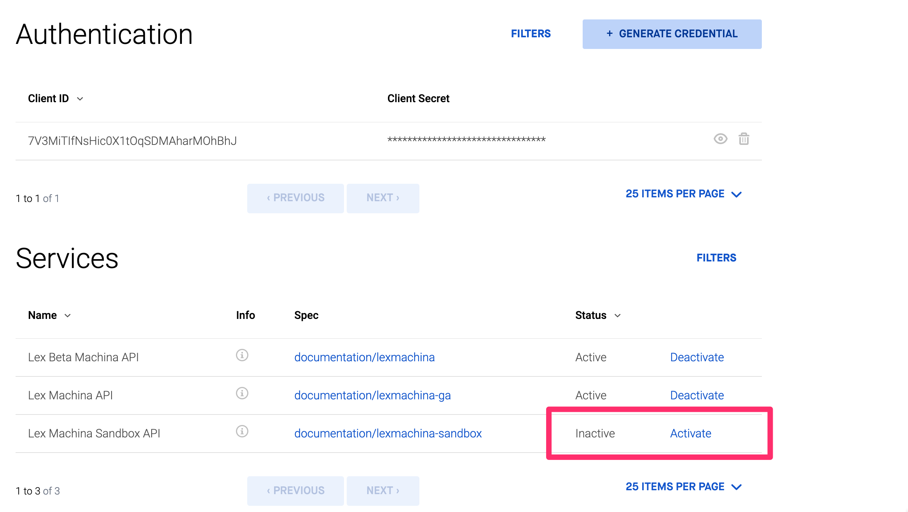
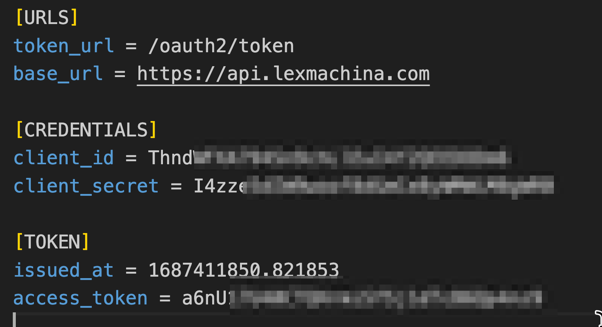
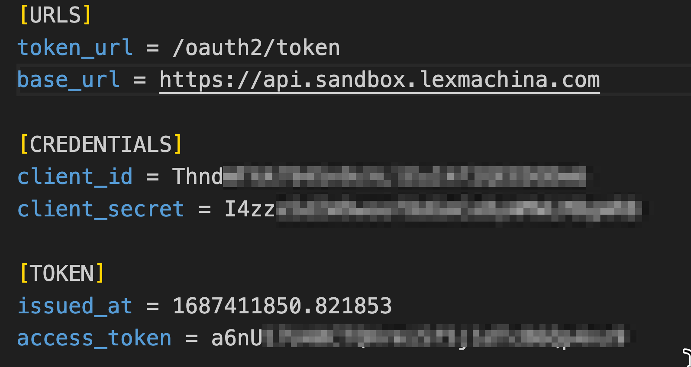
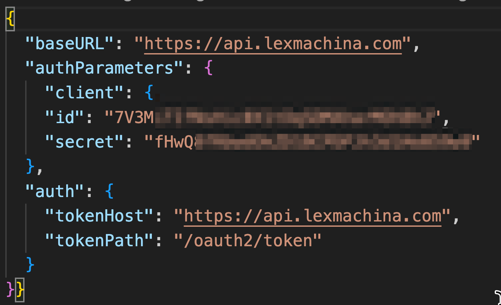
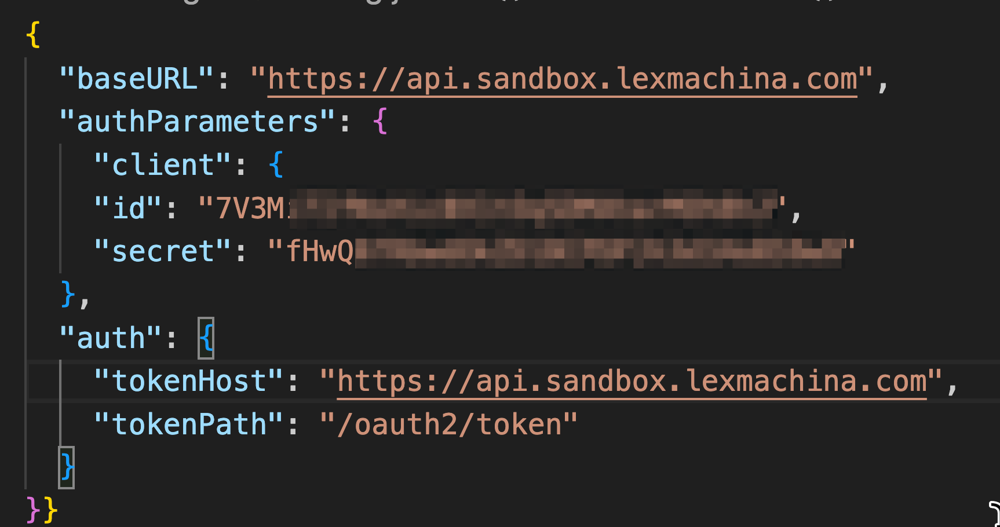

# Using the Sandbox API with Lex Machina Client Libraries
Lex Machina now not only has an API to allow automated access to our data but we also have a [Sandbox API](/post/sandbox-available) that allows prospective customers to test out the system with a subset of real data. For those potential users who are testing out the system to see if it meets needs, you can absolutely use the client libraries we have - python and node/JavaScript - to access the Sandbox. This article will walk through the steps.

In both clients, these steps assume that you have created an OAuth id/key and secret, and for that credential you have activated the sandbox as one of the services. You can have multiple services active on the same credential if you have access to them. If you fail to activate then you will get a "You cannot consume this service" error.



## Python

In the config file you use (typically config/config.ini) you need to alter the URL in a single place. In the [URLS] section, change the entry 

```ini
base_url = https://api.lexmachina.com
```

to 

```ini
base_url = https://api.sandbox.lexmachina.com
```
**Before**


**After**


## Node/Javascript

In the config file you use (typically config/config.json) you need to alter the URL in two places. In both baseURL and tokenHost you will need to change the URL to "https://api.sandbox.lexmachina.com". Leave the tokenPath as  "/oauth2/token". That is all that is required. At this point, any transactions you initiate from this client will be authentication against and using the Sandbox API. 

**Before**


**After**


## Conclusion

If you are interested in testing out the Lex Machina API and get access to the Sandbox API you will be able to use our clients to integrate if you so desire. Using those same scripts in production is as simple as activating the production service and changing a line or two in a config file. There is very little overhead in switching between the two. You don't even need to change the OAuth values if you don't want to. 

We hope this helps make it clear how simple it is to get started and to keep using the Lex Machina API. Good luck and happy integrating!